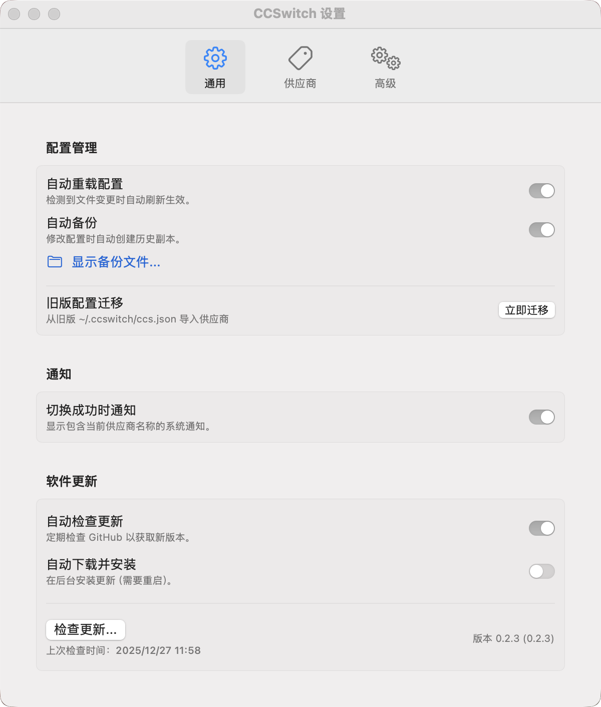

# CCSwitch for macOS

[](https://github.com/huangdijia/ccswitch-app/releases)
[](https://github.com/huangdijia/ccswitch-app/releases)
[](LICENSE)

一个用于快速切换 Claude Code 供应商的 macOS 状态栏工具。



## 功能特性

### ✅ 已实现功能

1. **状态栏集成**
   - macOS 状态栏图标显示
   - 当前供应商简称显示（可选）
   - 工具提示显示当前供应商信息

2. **供应商切换**
   - 一键切换 Claude Code 供应商
   - 支持多个供应商配置
   - 当前供应商标记（✓）
   - 预置供应商模板（Anthropic、DeepSeek、OpenAI等）

3. **配置管理**
   - 自动读取和写入 `~/.claude/settings.json`
   - 集中管理供应商配置（`~/.ccswitch/vendors.json`）
   - 配置自动备份机制
   - 支持配置模板复用

4. **设置界面**
   - General：通用设置、路径显示、通知权限管理、软件更新 🆕
   - 供应商管理：增删改查供应商，支持从旧配置导入
   - Advanced：备份管理、高级操作

5. **安全特性**
   - 切换前自动备份当前配置
   - 配置文件损坏保护
   - 权限检查和错误处理

6. **用户体验**
   - 状态栏联动切换
   - 切换成功通知（需授予通知权限）
   - 通知权限检测和引导
   - 详细的错误提示
   - 日志记录和问题报告
   - 多语言支持（简体中文、繁体中文、英文）

7. **架构优化** 🆕
   - 协议导向架构（Protocol-Oriented Architecture）
   - 依赖注入模式提升可测试性
   - 清晰的关注点分离
   - 易于扩展的模块化设计

8. **自动更新** 🆕
   - 基于 GitHub Releases 的自动更新检查
   - 自动下载和安装更新选项
   - 手动检查更新功能
   - 更新进度显示

## 安装使用

### 下载安装

1. 从 GitHub Releases 下载最新的 `CCSwitch.dmg`。
2. 将 `CCSwitch.app` 拖入 `Applications` 文件夹。
3. **重要提示**：由于应用未进行 Apple 开发者签名，首次安装后需在终端执行以下命令以解决“应用已损坏”或“无法验证开发者”的问题：

   ```bash
   xattr -rd com.apple.quarantine /Applications/CCSwitch.app/
   ```

### 源码构建 (开发用)

#### 构建要求

- macOS 14.6+
- Xcode 15.0+
- Swift 5.9+

### 构建步骤

1. 克隆项目：

```bash
git clone https://github.com/huangdijia/ccswitch-app.git
cd ccswitch-app
```

1. 运行构建脚本（多种方式）：

使用 Makefile（推荐）：

```bash
make build      # 完整构建（需要 Xcode）
make fast-build # 快速构建（仅需 Swift 命令行工具）
make run        # 构建并运行
make test       # 运行单元测试（需要 Xcode）
```

或使用 shell 脚本：

```bash
./build.sh
```

#### 开发构建和调试

项目提供了多个辅助脚本用于开发：

- **compile_swift.sh** - 使用 Swift 编译器直接编译（无需 Xcode）
- **run_dev.sh** - 开发模式运行（自动解除安全限制）
- **test_app.sh** - 测试应用基本功能
- **fix_and_run.sh** - 修复并运行应用（适用于首次运行）

快速开发运行：

```bash
./run_dev.sh
```

### 配置供应商

1. 在状态栏点击 CCSwitch 图标
2. 选择"设置..."
3. 在"供应商管理"标签页添加、编辑或导入供应商

### 切换供应商

1. 点击状态栏图标
2. 选择要切换到的供应商，或者在设置界面的供应商列表中切换开关
3. 配置将自动更新

## 配置文件格式

### CCSwitch 配置 (~/.ccswitch/vendors.json)

```json
{
  "version": 1,
  "current": "anthropic",
  "vendors": [
    {
      "id": "default",
      "displayName": "Default",
      "claudeSettingsPatch": {}
    },
    {
      "id": "deepseek",
      "displayName": "DeepSeek",
      "claudeSettingsPatch": {
        "ANTHROPIC_AUTH_TOKEN": "sk-xxxxxx",
        "ANTHROPIC_BASE_URL": "https://api.deepseek.com/anthropic",
        "ANTHROPIC_MODEL": "deepseek-chat",
        "ANTHROPIC_SMALL_FAST_MODEL": "deepseek-chat"
      }
    }
  ]
}
```

> **注意**：配置文件路径为 `~/.ccswitch/vendors.json`，参考示例文件 `CCSwitch/vendors.json.example`

### Claude 配置 (~/.claude/settings.json)

应用会自动更新此文件的 `env` 字段，保留其他现有字段。

## 项目结构

```
ccswitch-app/
├── build.sh                          # 主构建脚本
├── compile_swift.sh                  # Swift 编译脚本
├── run_dev.sh                        # 开发运行脚本
├── test_app.sh                       # 应用测试脚本
├── fix_and_run.sh                    # 修复并运行脚本
├── Makefile                          # Make 构建系统 🆕
├── README.md                         # 项目说明
├── README_XCODE.md                   # Xcode 使用指南
├── ARCHITECTURE.md                   # 架构文档 🆕
├── EXTENSION_GUIDE.md                # 扩展指南 🆕
├── CONTRIBUTING.md                   # 贡献指南 🆕
├── BUILD_REQUIREMENTS.md             # 构建要求说明 🆕
└── CCSwitch/
    ├── CCSwitch.xcodeproj            # Xcode 项目文件
    ├── CCSwitch.xcworkspace          # Xcode 工作空间
    ├── vendors.json.example         # 配置文件示例
    ├── CCSwitch/
    │   ├── App/
    │   │   ├── CCSwitchApp.swift        # 应用入口
    │   │   ├── MenuBarController.swift  # 状态栏控制器
    │   │   └── AppInfo.swift            # 应用版本信息 🆕
    │   ├── Models/
    │   │   ├── Vendor.swift             # 供应商模型
    │   │   ├── VendorTemplate.swift     # 供应商模板 🆕
    │   │   ├── CCSConfig.swift          # CCSwitch 配置
    │   │   └── ClaudeSettings.swift     # Claude 配置模型
    │   ├── Protocols/                   # 协议定义 🆕
    │   │   ├── VendorSwitcher.swift        # 供应商切换协议
    │   │   ├── ConfigurationRepository.swift # 配置仓库协议
    │   │   ├── SettingsWriter.swift        # 设置写入协议
    │   │   ├── BackupService.swift         # 备份服务协议
    │   │   ├── NotificationService.swift   # 通知服务协议
    │   │   └── SettingsRepository.swift    # 设置仓库协议
    │   ├── Services/
    │   │   ├── ConfigManager.swift      # 配置管理服务（重构）
    │   │   ├── ServiceContainer.swift   # 依赖注入容器 🆕
    │   │   ├── UpdateManager.swift      # 自动更新管理器 🆕
    │   │   ├── BackupManager.swift      # 备份管理
    │   │   ├── Logger.swift            # 日志系统
    │   │   └── ErrorHandler.swift      # 错误处理
    │   ├── Views/
    │   │   ├── SettingsView.swift       # 设置窗口主视图
    │   │   ├── GeneralSettingsView.swift    # 通用设置（含通知权限）
    │   │   ├── VendorManagementView.swift   # 供应商管理
    │   │   ├── VendorEditView.swift         # 供应商编辑
    │   │   └── AdvancedSettingsView.swift   # 高级设置
    │   └── Resources/
    │       ├── Info.plist
    │       ├── AppIcon.icns
    │       ├── en.lproj/                # 英文本地化
    │       ├── zh-Hans.lproj/           # 简体中文本地化
    │       └── zh-Hant.lproj/           # 繁体中文本地化
    └── CCSwitchTests/
        ├── ConfigManagerTests.swift     # 配置管理测试 🆕
        ├── ModelTests.swift             # 模型测试 🆕
        └── Mocks/                       # Mock对象 🆕
            ├── MockConfigurationRepository.swift
            └── MockServices.swift
```

## 测试

运行单元测试：

使用 Makefile：

```bash
make test       # 运行单元测试（需要 Xcode）
make test-app   # 运行手动测试脚本
```

或使用命令行：

```bash
cd CCSwitch
xcodebuild test -project CCSwitch.xcodeproj -scheme CCSwitch -destination 'platform=macOS'
```

或使用测试脚本：

```bash
./test_app.sh
```

## 架构

CCSwitch 采用**协议导向架构**（Protocol-Oriented Architecture）配合**依赖注入**模式：

- ✅ **高可测试性**：所有核心组件都有协议定义和 Mock 实现
- ✅ **高复用性**：通过协议抽象和依赖注入实现组件复用
- ✅ **低耦合**：清晰的关注点分离，各层职责明确
- ✅ **易扩展**：新增供应商、存储后端、通知渠道等无需修改核心代码

详细架构文档请参考：

- [ARCHITECTURE.md](ARCHITECTURE.md) - 架构设计详解
- [EXTENSION_GUIDE.md](EXTENSION_GUIDE.md) - 扩展开发指南
- [CONTRIBUTING.md](CONTRIBUTING.md) - 贡献指南

## 贡献

欢迎提交 Issue 和 Pull Request！

在贡献之前，请阅读：

- [CONTRIBUTING.md](CONTRIBUTING.md) - 贡献指南
- [ARCHITECTURE.md](ARCHITECTURE.md) - 了解项目架构
- [EXTENSION_GUIDE.md](EXTENSION_GUIDE.md) - 学习如何扩展功能

## 许可证

MIT License

## 更新日志

### v0.1.7 (2025-12-21)

- ✨ 新增自动更新功能（基于 GitHub Releases）
- ✨ 新增软件更新设置界面
- ✨ 新增 AppInfo 工具类用于获取版本信息
- 🔧 添加 Makefile 支持多种构建方式
- 🔧 完善本地化字符串
- 📝 更新文档和架构说明
- 🎉 初始版本发布
- 🎯 实现所有核心功能
- ✅ 支持供应商切换和配置管理
- ✅ 支持通知权限检测和引导
- ✅ 多语言支持（简体中文、繁体中文、英文）
- 🛠️ 提供多个开发辅助脚本
