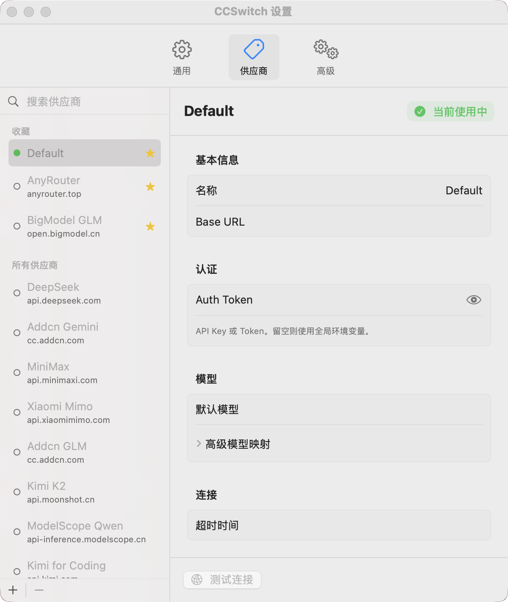

# CCSwitch for macOS

[](https://github.com/huangdijia/ccswitch-app/releases)
[](https://github.com/huangdijia/ccswitch-app/releases)
[](LICENSE)

A macOS menu bar tool for quickly switching Claude Code providers.

[简体中文](README_CN.md)



## Features

### ✅ Implemented Features

1. **Menu Bar Integration**
   - macOS menu bar icon display
   - Current provider abbreviation display (optional)
   - Tooltip showing current provider information

2. **Provider Switching**
   - One-click Claude Code provider switching
   - Support for multiple provider configurations
   - Current provider indicator (✓)
   - Preset provider templates (Anthropic, DeepSeek, OpenAI, etc.)
   - Favorites system for quick access to preferred providers

3. **Configuration Management**
   - Automatic read/write of `~/.claude/settings.json`
   - Centralized provider configuration management (`~/.ccswitch/vendors.json`)
   - Automatic configuration backup mechanism
   - Configuration template reuse support
   - Automatic migration from legacy configuration formats

4. **Settings Interface**
   - General: General settings, path display, notification permission management, software updates
   - Provider Management: Add/edit/delete providers, import from old configurations
   - Advanced: Backup management, advanced operations, iCloud sync settings

5. **iCloud Sync** 🆕
   - Bidirectional synchronization across multiple Macs
   - Automatic conflict detection and resolution UI
   - Network monitoring with offline/online state tracking
   - Automatic retry with exponential backoff
   - Real-time sync status display

6. **Toast Notifications** 🆕
   - Success, info, and error toast types
   - SwiftUI-based overlay with smooth animations
   - Auto-dismiss after 2 seconds
   - Proper queuing for multiple notifications

7. **Security Features**
   - Automatic backup before switching
   - Configuration file corruption protection
   - Permission checks and error handling
   - Ed25519 signature verification for software updates

8. **User Experience**
   - Menu bar synchronized switching
   - Switch success notifications (requires notification permission)
   - Notification permission detection and guidance
   - Detailed error messages
   - Logging and issue reporting
   - Multi-language support (Simplified Chinese, Traditional Chinese, English)
   - Unsaved changes detection and confirmation prompts

9. **Architecture Optimization**
   - Protocol-Oriented Architecture
   - Dependency injection pattern for improved testability
   - Clear separation of concerns
   - Easy-to-extend modular design

10. **Auto Update**
    - Automatic update checking based on GitHub Releases
    - Automatic download and install update options
    - Manual check for updates functionality
    - Update progress display
    - Sparkle integration with Ed25519 signature verification

## Installation and Usage

### Download and Install

1. Download the latest `CCSwitch.dmg` from GitHub Releases.
2. Drag `CCSwitch.app` into the `Applications` folder.
3. **Important**: Since the app is not signed with an Apple Developer certificate, you need to run the following command in Terminal after first installation to resolve the "app is damaged" or "unable to verify developer" issue:

   ```bash
   xattr -rd com.apple.quarantine /Applications/CCSwitch.app/
   ```

### Build from Source (For Development)

#### Build Requirements

- macOS 14.6+
- Xcode 15.0+
- Swift 5.9+

### Build Steps

1. Clone the project:

```bash
git clone https://github.com/huangdijia/ccswitch-app.git
cd ccswitch-app
```

2. Run build script (multiple options):

Using Makefile (recommended):

```bash
make build      # Full build (requires Xcode)
make fast-build # Fast build (only requires Swift command line tools)
make run        # Build and run
make test       # Run unit tests (requires Xcode)
```

Or use shell script:

```bash
./build.sh
```

#### Development Build and Debug

The project provides several helper scripts for development:

- **compile_swift.sh** - Compile directly with Swift compiler (no Xcode required)
- **run_dev.sh** - Run in development mode (automatically removes security restrictions)
- **test_app.sh** - Test basic app functionality
- **fix_and_run.sh** - Fix and run the app (for first run)

Quick development run:

```bash
./run_dev.sh
```

### Configure Providers

1. Click the CCSwitch icon in the menu bar
2. Select "Settings..."
3. Add, edit, or import providers in the "Provider Management" tab

### Switch Providers

1. Click the menu bar icon
2. Select the provider you want to switch to, or toggle the switch in the provider list in the settings interface
3. Configuration will be updated automatically

## Configuration File Format

### CCSwitch Configuration (~/.ccswitch/vendors.json)

```json
{
  "version": 1,
  "current": "anthropic",
  "vendors": [
    {
      "id": "default",
      "displayName": "Default",
      "claudeSettingsPatch": {}
    },
    {
      "id": "deepseek",
      "displayName": "DeepSeek",
      "claudeSettingsPatch": {
        "ANTHROPIC_AUTH_TOKEN": "sk-xxxxxx",
        "ANTHROPIC_BASE_URL": "https://api.deepseek.com/anthropic",
        "ANTHROPIC_MODEL": "deepseek-chat",
        "ANTHROPIC_SMALL_FAST_MODEL": "deepseek-chat"
      }
    }
  ]
}
```

> **Note**: Configuration file path is `~/.ccswitch/vendors.json`, refer to example file `CCSwitch/vendors.json.example`

### Claude Configuration (~/.claude/settings.json)

The app will automatically update the `env` field of this file while preserving other existing fields.

## iCloud Sync

CCSwitch supports **iCloud synchronization** to keep your vendor configurations in sync across multiple Macs.

### Features

- **Bidirectional Sync**: Changes made on any Mac automatically sync to all your other devices
- **Conflict Resolution**: When conflicts are detected, you can choose which version to keep (local or remote)
- **Network Awareness**: Automatically detects offline/online status and syncs when connectivity is restored
- **Automatic Retry**: Uses exponential backoff to retry failed sync operations (up to 3 attempts)
- **Real-time Status**: View sync status directly in the Advanced settings

### How It Works

1. **Enable Sync**: Go to Settings → Advanced → Enable "iCloud Sync"
2. **Automatic Upload**: Changes to vendors are automatically uploaded to iCloud (2-second debounce)
3. **Automatic Download**: Changes from other devices are detected and downloaded automatically
4. **Conflict Handling**: If both local and remote versions change, you'll see a conflict resolution dialog

### Sync Status States

| Status | Description |
|--------|-------------|
| 🟤 Idle | Sync is enabled, no pending changes |
| 🔵 Syncing | Currently uploading/downloading changes |
| 🟢 Synced | Changes successfully synchronized |
| 🟠 Offline | No internet connection, sync paused |
| 🔴 Error | Sync failed (check logs for details) |

### Requirements

- **iCloud Account**: Must be signed in to iCloud on your Mac
- **iCloud Key-Value Storage**: Must be enabled in System Settings → Apple ID → iCloud
- **Network Connection**: Active internet connection for sync

### Technical Details

- **Storage**: Uses `NSUbiquitousKeyValueStore` for iCloud key-value storage
- **Data Size**: Each vendor configuration is stored as JSON-encoded data
- **Conflict Detection**: Compares local vs remote vendor versions
- **Privacy**: All data is encrypted by Apple's iCloud infrastructure

## Project Structure

```
ccswitch-app/
├── build.sh                          # Main build script
├── compile_swift.sh                  # Swift compilation script
├── run_dev.sh                        # Development run script
├── test_app.sh                       # Application test script
├── fix_and_run.sh                    # Fix and run script
├── Makefile                          # Make build system
├── appcast.xml                       # Sparkle update feed
├── README.md                         # Project documentation
├── README_CN.md                      # Chinese documentation
├── README_XCODE.md                   # Xcode usage guide
├── ARCHITECTURE.md                   # Architecture documentation
├── EXTENSION_GUIDE.md                # Extension guide
├── CONTRIBUTING.md                   # Contributing guide
├── BUILD_REQUIREMENTS.md             # Build requirements documentation
└── CCSwitch/
    ├── CCSwitch.xcodeproj            # Xcode project file
    ├── CCSwitch.xcworkspace          # Xcode workspace
    ├── vendors.json.example         # Configuration file example
    ├── CCSwitch/
    │   ├── App/
    │   │   ├── CCSwitchApp.swift        # App entry point
    │   │   ├── MenuBarController.swift  # Menu bar controller
    │   │   └── AppInfo.swift            # App version information
    │   ├── Models/
    │   │   ├── Vendor.swift             # Provider model
    │   │   ├── VendorTemplate.swift     # Provider template
    │   │   ├── CCSConfig.swift          # CCSwitch configuration
    │   │   └── ClaudeSettings.swift     # Claude configuration model
    │   ├── Protocols/                   # Protocol definitions
    │   │   ├── VendorSwitcher.swift        # Provider switching protocol
    │   │   ├── ConfigurationRepository.swift # Configuration repository protocol
    │   │   ├── SettingsWriter.swift        # Settings writer protocol
    │   │   ├── BackupService.swift         # Backup service protocol
    │   │   ├── NotificationService.swift   # Notification service protocol
    │   │   ├── SettingsRepository.swift    # Settings repository protocol
    │   │   └── CloudStorageService.swift   # iCloud storage protocol 🆕
    │   ├── Services/
    │   │   ├── ConfigManager.swift      # Configuration management service
    │   │   ├── ServiceContainer.swift   # Dependency injection container
    │   │   ├── UpdateManager.swift      # Auto update manager
    │   │   ├── SyncManager.swift        # iCloud sync manager 🆕
    │   │   ├── ICloudStorageService.swift # iCloud storage implementation 🆕
    │   │   ├── ToastManager.swift      # Toast notification manager 🆕
    │   │   ├── BackupManager.swift      # Backup management
    │   │   ├── Logger.swift            # Logging system
    │   │   └── ErrorHandler.swift      # Error handling
    │   ├── Views/
    │   │   ├── SettingsView.swift       # Settings window main view
    │   │   ├── GeneralSettingsView.swift    # General settings
    │   │   ├── VendorManagementView.swift   # Provider management
    │   │   ├── VendorEditView.swift         # Provider editing
    │   │   ├── AdvancedSettingsView.swift   # Advanced settings
    │   │   ├── SyncStatusView.swift         # Sync status indicator 🆕
    │   │   ├── SyncConflictResolverView.swift # Conflict resolution UI 🆕
    │   │   └── ToastView.swift              # Toast component 🆕
    │   └── Resources/
    │       ├── Info.plist
    │       ├── AppIcon.icns
    │       ├── en.lproj/                # English localization
    │       ├── zh-Hans.lproj/           # Simplified Chinese localization
    │       └── zh-Hant.lproj/           # Traditional Chinese localization
    └── CCSwitchTests/
        ├── ConfigManagerTests.swift     # Configuration management tests
        ├── ModelTests.swift             # Model tests
        ├── CloudStorageServiceTests.swift  # Cloud storage tests 🆕
        ├── SyncManagerTests.swift      # Sync manager tests 🆕
        └── Mocks/                       # Mock objects
            ├── MockConfigurationRepository.swift
            ├── MockServices.swift
            └── MockCloudStorageService.swift 🆕
```

## Testing

Run unit tests:

Using Makefile:

```bash
make test       # Run unit tests (requires Xcode)
make test-app   # Run manual test script
```

Or using command line:

```bash
cd CCSwitch
xcodebuild test -project CCSwitch.xcodeproj -scheme CCSwitch -destination 'platform=macOS'
```

Or using test script:

```bash
./test_app.sh
```

## Architecture

CCSwitch uses **Protocol-Oriented Architecture** with **Dependency Injection** pattern:

- ✅ **High Testability**: All core components have protocol definitions and Mock implementations
- ✅ **High Reusability**: Component reuse through protocol abstraction and dependency injection
- ✅ **Low Coupling**: Clear separation of concerns, well-defined responsibilities for each layer
- ✅ **Easy Extension**: Add new providers, storage backends, notification channels without modifying core code

For detailed architecture documentation, please refer to:

- [ARCHITECTURE.md](ARCHITECTURE.md) - Architecture design details
- [EXTENSION_GUIDE.md](EXTENSION_GUIDE.md) - Extension development guide
- [CONTRIBUTING.md](CONTRIBUTING.md) - Contributing guide

## Contributing

Issues and Pull Requests are welcome!

Before contributing, please read:

- [CONTRIBUTING.md](CONTRIBUTING.md) - Contributing guide
- [ARCHITECTURE.md](ARCHITECTURE.md) - Understand project architecture
- [EXTENSION_GUIDE.md](EXTENSION_GUIDE.md) - Learn how to extend features

## License

MIT License

## Changelog

### v0.2.3 (2025-12-27)

- 🔧 Simplified automatic update check initiation by removing async task wrapper
- 🐛 Fixed update check timing and improved reliability

### v0.2.2 (2025-12-26)

- ✨ Simplified sync logic - now syncs ALL vendors automatically (removed selective sync)
- 🔧 Improved sync status handling - always set success after cloud write
- 📝 Better logging for disk synchronization failures

### v0.2.1 (2025-12-25)

- ✨ **iCloud Sync** - Full bidirectional synchronization across multiple Macs
  - Automatic conflict detection and resolution UI
  - Network monitoring with offline/online state tracking
  - Automatic retry with exponential backoff
  - Real-time sync status display
- 🎨 Added SyncStatusView for real-time sync status
- 🎨 Added SyncConflictResolverView for conflict resolution

### v0.2.0 (2025-12-24)

- ✨ **Automated Release Workflow** - GitHub Actions for automated builds and releases
- ✨ **Sparkle Integration** - Auto-update support with Ed25519 signature verification
- ✨ **DMG Creation** - Automated DMG creation for distribution
- 🎨 Improved UI alignment for vendor and settings views
- 🔧 Added localization bundle configuration
- 🔧 Fixed AppIcon bundling in CI

### v0.1.10 (2025-12-23)

- 📝 Updated GitHub repository links to ccswitch-app
- 🔧 Fixed error handling logic in UpdateManager
- 📝 Added bilingual documentation (Chinese and English README)

### v0.1.9 (2025-12-22)

- ✨ **Preset Vendors** - Added recommended vendor templates
- ✨ Auto-initialization with preset configurations
- 🎨 Improved vendor management UI

### v0.1.8 (2025-12-21)

- ✨ **Configuration Migration** - Automatic migration from legacy config formats
- 🎨 Added MigrationAlertView for seamless upgrades
- 🔧 Refactored migration manager into ConfigManager
- 🔧 Improved migration error handling
- 📝 Added GitHub badges (version, downloads, license)

### v0.1.7 (2025-12-21)

- ✨ Added auto-update feature (based on GitHub Releases)
- ✨ Added software update settings interface
- ✨ Added AppInfo utility class for version information
- 🔧 Added Makefile support for multiple build methods
- 🔧 Improved localization strings
- 📝 Updated documentation and architecture description
- 🎉 Initial release
- 🎯 Implemented all core features
- ✅ Support for provider switching and configuration management
- ✅ Support for notification permission detection and guidance
- ✅ Multi-language support (Simplified Chinese, Traditional Chinese, English)
- 🛠️ Provided multiple development helper scripts
